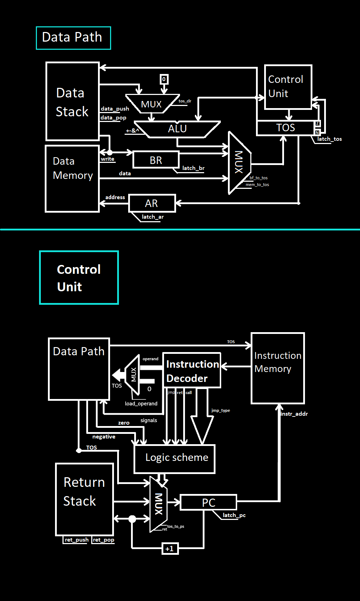

# Лабораторная работа №3 "Эксперимент"

## Вариант
```
lisp -> asm | stack | harv | hw | instr | struct | stream | mem | cstr | prob2 | cache
```
 - Качанов Даниил Владимирович P3206
 - Упрощенный вариант

### Расшифровка
   - Низкоуровневый язык ***Assembler*** с поддержкой меток
   - Стековая архитектура процессора
   - ***Гарвардская архитектура*** (раздельная память для команд и данных)
   - Control Unit реализуется как часть модели
   - Симуляция с точностью до ***инструкций***
   - Машинный код хранится как ***высокоуровневая структура***
   - ***Потоковый*** ввод-вывод (без прерываний)
   - Порты ввода вывода отображаются в память и доступ к ним осуществляется штатными командами
   - ***С strings*** (длина строки + содержимое)
   - Project euler problem 2
   - ~~Кэширование~~ (не реализовано)

## Оглавление
1. [Вариант](#вариант)
    - [Расшифровка](#расшифровка)
2. [Язык программирования](#язык-программирования)
   - [Синтаксис](#синтаксис)
   - [Семантика](#семантика)
   - [Типы аргументов](#типы-аргументов)
3. [Организация памяти](#организация-памяти)
4. [Система команд](#система-команд)
5. [Транслятор](#транслятор)
6. [Модель процессора](#модель-процессора)
7. [Тестирование](#тестирование)
8. [Статистика](#статистика)

## Язык программирования

Реализуется подмножество языка Assembler для программ из задания. [Сами программы](tests). 

### Синтаксис

```ebnf
program ::= <section_code> <section_data> | <section_code> 
<section_data> ::= "section .data:" <data>
<section_code> ::= "section .text:" <code>
<data> ::= (<comment> | <variable>) <data>
<code> ::= (<comment> | <label> | <instruction>) <code>
<comment> ::= "#" <character>*
<label> ::= "."<name> ":"
<name> ::= [a-zA-Z]+
<variable> ::= <name> ":" (<int> | <string>)
<string> ::= '"' <character>* '"'
<character> ::= any printable ASCII character
<int> ::= - <DIGIT>+
<un_ops> ::= ("push") " "  (<label> | <variable> | <int>)
<workflow> ::= ("jmp" | "je" | "jg" |  "jne" | "jle" | "jl" | "jge" | "call" | "ret")
<zero_arg> ::= ("nop", "xchng", "pop", "ld", "st", "dup", "inc", "add", "sub", "or", "and")
<instruction> ::= <un_ops> | <workflow> | <branch> | <zero_arg>
```

### Семантика
Код выполняется последовательно, одна инструкция за одной.

Список доступных [инструкций](). 

Метки определяются на отдельной строке исходного кода:

```asm
label:
        add
```

Далее метки могут быть использованы (неважно, до или после определения) в исходном коде:

```asm
label_addr:
        push label ; на вершине стека находится адрес на ячейку памяти add
```

Метки не чувствительны к регистру. Повторное определение меток недопустимо.  
Определение меток `label` и `LaBeL` считается повторением.

Использовать определённую метку можно неограниченное число раз.  
Транслятор поставит на место использования метки адрес той инструкции, перед которой она определена.

Любая программа обязана иметь метку `start`, указывающую на первую исполняемую команду.


### Типы аргументов
    Операнд (адреса, значения, метки)
    Операнд существует только у инструкции push

## Организация памяти

* Вся внешняя память - статическая, SRAM
* Машинное слово – не определено. Инструкции хранятся в высокоуровневой структуре данных.
* Программа и данные хранятся в раздельной памяти согласно Гарвардской архитектуре.
  Программа состоит из набора инструкций, последняя инструкция – `hlt`.
* Адресация – прямая, абсолютная, доступ к словам.
* Доступ к памяти осуществляется по адресу c вершины стека
```

       Registers
+------------------------------+
| BR                           |
+------------------------------+
| AR                           |
+------------------------------+
| PC                           |
+------------------------------+

       Instruction memory
+------------------------------+
|    ...                       |
| n   : program start          |
|    ...                       |
|                              |
+------------------------------+

          Data memory
+------------------------------+
| 00  : IO                     |
| 01  : output number format   |
| 02  : reserved               |
|    ...                       |
| c+0 : variable 1             |
|    ...                       |
+------------------------------+


```


## Система команд

Особенности процессора:

* Машинное слово – не определено.
* Тип данных - знаковые числа или символы ascii (в рамках модели на python эти типы так и хранятся)
* Поток управления:
  * Значение `PC` инкрементируется после исполнения каждой инструкции;
  * Множество условных переходом (`jle`, `jl` , `jge`, `jg`, `jz`, `jnz`) и безусловные (`jmp`) переходы;
  * Процессор моделируется с точностью до каждой инструкции
  * Операнд существует только у инструкции `push`, на вершину стека кладется адрес метки, переменной или константа.

Набор инструкций:

* `nop` – нет операции.
* `ld` – загрузить на вершину стека из памяти значение по адресу с вершины стека.
* `st`  – загрузить в память значение вершины стека по адресу с вершины стека.
* `inc` - увеличить значение на вершине стека на 1.
* `add` - элемент на вершине стека складывается с предыдущим элементом на стеке и замещается результатом.
* `sub` - из элемента на вершине стека вычитается предыдущий элемент на стеке и замещается результатом.
* `and` – к первым двум элементам на вершине стека применяется побитовое логическое умножение.
* `or` - к первым двум элементам на вершине стека применяется побитовое логическое сложение
* `jg` – если значение на вершине стека больше 0, начать исполнять инструкции по указанному адресу. Условный переход.
* `jge` – если значение на вершине стека не меньше 0, начать исполнять инструкции по указанному адресу. Условный переход.
* `jl` – если значение на вершине стека меньше 0, начать исполнять инструкции по указанному адресу. Условный переход.
* `jle` – если значение на вершине стека не больше 0, начать исполнять инструкции по указанному адресу. Условный переход.
* `jz` – если значение на вершине равно 0, начать исполнять инструкции по указанному адресу. Условный переход.
* `jnz` – если значение на вершине не равно 0, начать исполнять инструкции по указанному адресу. Условный переход.
* `jmp` – безусловный переход по адресу на вершине стека.
* `call` - выполнить подпрограмму по адресу из вершины стека.
* `ret` - возврат из подпрограммы.
* `push {label | variable | constant}` - положить на вершину стека адрес метки, переменной или константу.
* `hlt` – остановка тактового генератора.

Согласно [варианту](#вариант) машинный код хранится в высокоуровневой структуре. 
Это реализуется списком словарей (в python соответствуют json объектам).
Один элемент списка — это одна инструкция.
Инструкция представлена списком в виде индекса инструкции в списке, инструкцией, аргументом или пустой строкой в случае его отсутствия.
Индекс инструкции в списке – адрес этой инструкции в памяти команд.

Пример скомпилированной программы:
```json
{
    "code": [
        [
            "0",
            "push",
            "3"
        ],
        [
            "1",
            "dup",
            ""
        ],
        [
            "2",
            "ld",
            ""
        ],
        [
            "3",
            "push",
            "12"
        ],
        [
            "4",
            "xchng",
            ""
        ],
        [
            "5",
            "jz",
            ""
        ],
        [
            "6",
            "push",
            "0"
        ],
        [
            "7",
            "st",
            ""
        ],
        [
            "8",
            "pop",
            ""
        ],
        [
            "9",
            "inc",
            ""
        ],
        [
            "10",
            "push",
            "1"
        ],
        [
            "11",
            "jmp",
            ""
        ],
        [
            "12",
            "pop",
            ""
        ],
        [
            "13",
            "hlt",
            ""
        ]
    ],
    "memory": [
        [
            "3",
            "72"
        ],
        [
            "4",
            "101"
        ],
        [
            "5",
            "108"
        ],
        [
            "6",
            "108"
        ],
        [
            "7",
            "111"
        ],
        [
            "8",
            "44"
        ],
        [
            "9",
            "32"
        ],
        [
            "10",
            "119"
        ],
        [
            "11",
            "111"
        ],
        [
            "12",
            "114"
        ],
        [
            "13",
            "108"
        ],
        [
            "14",
            "100"
        ],
        [
            "15",
            "33"
        ],
        [
            "16",
            "10"
        ],
        [
            "17",
            "0"
        ]
    ]
}
```
Где:
* `memory` – память данных
* `code` - список инструкций

Система команд реализована в модуле [isa](/isa.py).

## Транслятор
Формат запуска: `./translator.py <input_file> <target_file> ` 
Реализован в [translator.py](/translator.py)
Компиляция осуществляется в 4 прохода по тексту программы:
- Проход по секции .data: преобразовывает данные в словарь переменная -> адрес в памяти данных.
- Первый проход по секции .text: получает словарь метка -> адрес в памяти команд.
- Второй проход по секции .text: подставляет все переменные и метки используя словари полученные на этапах выше.

## Модель процессора

Формат запуска: `./machine.py <machine_code_file> <input_file>`
### DataPath

Реализован в классе `DataPath`.
- `BR` - буферный регистр
- `AR` - регистр адреса Data Memory
- `Data Stack` - стек для данных
- `Data Memory` - память для данных
- `TOS` - вершина стека
- `ALU` - арифметико-логическое устройство

Сигналы:
- `tos_clr` - на левый вход АЛУ подается 0
- `data_push` - добавить значение на вершины Data Stack
- `data pop` - извлечь значние с вершины Data Stack
- `write` - записать значение
- `address` - установить адрес памяти по значению из AR
- `bf_to_tos` - загрузить значение из буферного регистра в TOS
- `mem_to_tos` - записать значение из памяти в TOS
- `latch_ar`,`latch_br`, `latch_tos` - защелкнуть AR, BR, TOS cоответсвенно
  Флаги:
- `zero` - отражает наличие нулевого значения в аккумуляторе.
- `negative` - отражает наличие положительного значения в аккумуляторе
### ControlUnit

Реализован в классе `ControlUnit`

- `PC`-  Program counter, счетчик команд
- `Return Stack` - стек с адресами возвратов подпрограмм
- `Logic scheme` - логическая схема, для управления ветвлениями, в случае ветвления сопоставлет  тип команды перехода согласно флагам zero и negative
- `Instruction memory` - память команд
- `Instruction Decoder` - интерпретатор машинных инструкций, если инструкция имеет операнд, то подается сигнал load_operand и значение операнда записывается в TOS.

Сигналы:
-    `instr_addr` - установить адрес памяти команд
-    `ret_push` - положить адрес возврата на Return Stack
-    `ret_pop` -  извлечь значение с вершины стека
-    `load_operand` - загрузить операнд в TOS
-    `ret` - извлечь из вершины Return Stack значение в PC
-    `tos_to_pc` - установить значение PC значению TOS

# Тестирование проекта

Тестирование осуществляется при помощи golden test-ов.
Настройки golden тестирования находятся в файле `tests/test_machine.py`.
Конфигурация golden test-ов лежит в директории `golden`.

## Тестовое покрытие

- `cat` – повторяет поток ввода на вывод;
- `hello user` – печатает на выход приветствие пользователя;
- `hello world` – печатает на выход “Hello, world!”;
- `prob2` – сумма четных чисел Фиббоначи меньших 1000000.

## Запустить тесты

```sh
pytest tests/test_machine.py

## CI
CI описывается в файла python.yaml:
```yaml
name: Python CI/CD

on:
  push:
    branches:
      - main
  pull_request:
    branches:
      - main

jobs:
  test:
    runs-on: ubuntu-latest

    steps:
      - name: Checkout code
        uses: actions/checkout@v4

      - name: Set up Python
        uses: actions/setup-python@v4
        with:
          python-version: 3.11

      - name: Install dependencies
        run: |
          python -m pip install --upgrade pip
          pip install poetry
          poetry install

      - name: Run tests and collect coverage
        run: |
          poetry run coverage run -m pytest .
          poetry run coverage report -m
        env:
          CI: true

  lint:
    runs-on: ubuntu-latest

    steps:
      - name: Checkout code
        uses: actions/checkout@v4

      - name: Set up Python
        uses: actions/setup-python@v4
        with:
          python-version: 3.11

      - name: Install dependencies
        run: |
          python -m pip install --upgrade pip
          pip install poetry
          poetry install

      - name: Check code formatting with Ruff
        run: echo Ok

      - name: Run Ruff linters
        run: poetry run ruff check .


## Пример тестирования
```sh
$ pytest
========================================== test session starts ==========================================
platform linux -- Python 3.12.3, pytest-8.2.1, pluggy-1.5.0
rootdir: /home/Daniil/Desktop/АК/csa-lab3
configfile: pyproject.toml
plugins: regressions-2.5.0, datadir-1.5.0, diff-0.1.14, golden-0.2.2, typeguard-4.2.1, anyio-4.3.0
collected 4 items                                                                                       

tests/test_machine.py ....                                                                        [100%]

=========================================== 4 passed in 5.73s ===========================================

```

## Статистика 
```text
| ФИО                         | алг        | LoC | code инстр. | инстр. | вариант                                                                |
| Качанов Даниил Владимирович | hello user | 64  | 41          | 728    | asm | stack | harv | hw | instr | struct | stream | mem | cstr | prob2 |
| Качанов Даниил Владимирович | cat        | 19  | 12          | 149    | asm | stack | harv | hw | instr | struct | stream | mem | cstr | prob2 |
| Качанов Даниил Владимирович | hello world| 20  | 14          | 161    | asm | stack | harv | hw | instr | struct | stream | mem | cstr | prob2 |
| Качанов Даниил Владимирович | prob2      | 45  | 43          | 67     | asm | stack | harv | hw | instr | struct | stream | mem | cstr | prob2 |
```
